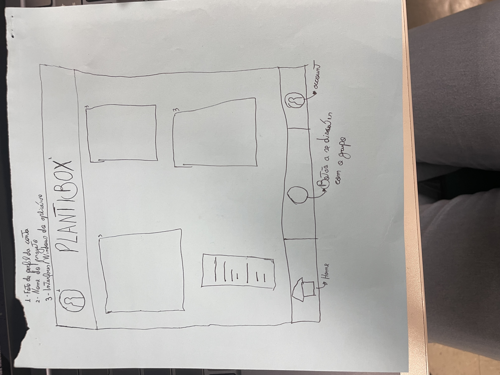
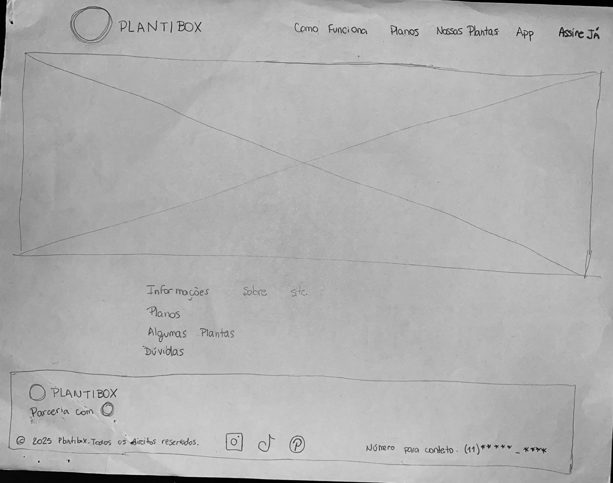
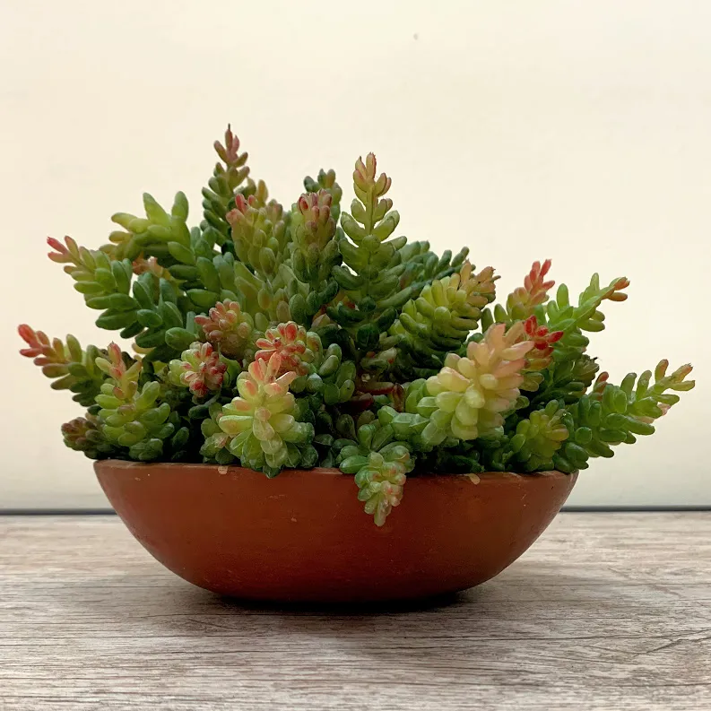
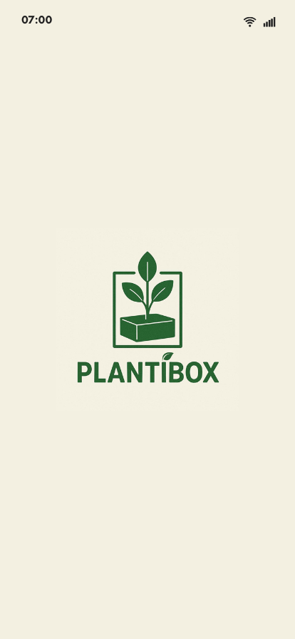

# projeto-web-n1

ARTHUR FERREIRA BARROS- 10439829
DAVID RODRIGUES DE OLIVEIRA- 10410867
ERICKA FERNANDA LIMA DE QUEIROZ- 10420084
GUSTAVO SANCHES SIMAO- 10436440
THAYNARA BARBOSA DE ALMEIDA DA SILVA- 10410900

O grupo decidiu desenvolver um serviço de assinatura de plantas focado na terceira idade. O projeto consiste em uma plataforma web mobile onde o usuário contrata uma assinatura para receber plantas periodicamente em casa. O diferencial está no aplicativo simplificado de acompanhamento, que utiliza uma linguagem clara e visual para ensinar o idoso a cuidar de cada espécie (frequência de rega, exposição ao sol, adubação), promovendo a terapia do cuidado e o bem-estar mental.
O processo de definição deste tema ocorreu através de um brainstorming focado em impacto social e acessibilidade, onde houve um debate de como a tecnologia poderia auxiliar no combate à solidão e no estímulo cognitivo de idosos. Durante a discussao, refinamos a ideia inicial de um simples e-commerce para um modelo de assinatura com suporte educativo, votando por esta proposta devido ao seu alto valor humano e ao desafio técnico de criar uma interface "Senior-Friendly" (amigável para idosos). A decisão foi consolidada pela percepção de que o cuidado com plantas é uma atividade terapêutica comprovada, e a tecnologia pode ser a ponte para facilitar esse hábito sem gerar frustrações técnicas ao usuário.
O projeto apresenta caráter extensionista ao aplicar o conhecimento tecnológico desenvolvido pelos estudantes para gerar impacto social na comunidade, especialmente na população idosa. A plataforma Plantibox busca promover bem-estar mental, estímulo cognitivo e redução da solidão por meio do cuidado com plantas, utilizando um aplicativo simples e acessível para orientar os usuários da terceira idade. Para ampliar esse impacto, o projeto prevê parceria com a Pastoral da Pessoa Idosa, organização que atua no apoio e acompanhamento de idosos no estado de São Paulo, possibilitando validar a solução com o público real, realizar testes de usabilidade e promover atividades educativas. Dessa forma, o projeto integra universidade e comunidade, utilizando a tecnologia como ferramenta de inclusão digital e promoção da qualidade de vida.

CÓDIDO HTML
~~~
    <header>
        

        <nav>
            <ul>
                <li><a href="#como-funciona">Como Funciona</a></li>
                <li><a href="#planos">Planos</a></li>
                <li><a href="#plantas">Nossas Plantas</a></li>
                <li><a href="#app">Nosso App</a></li>
                <li><a href="#planos">Assine Já</a></li>
            </ul>
        </nav>
    </header>
~~~

Na header colocamos duas imagens para representar o ícone e uma imagem do Plantibox. Dentro do nav colocamos 5 links que redirecionam a diferentes abas. São elas: como funciona o site, nossos planos, nossas plantas, nosso aplicativo e o redirecionamento para fazer a assinatura.

~~~
<main>
        <section>
            <h1>Reconecte-se com a natureza, uma planta por vez.</h1>
            
Receba mini-plantas em casa todo mês e transforme seu espaço em um refúgio verde. Cuidar de plantas nunca foi tão fácil e prazeroso.

            <a href="#planos">Quero minhas plantas!</a>
        </section>

        <section id="como-funciona">
            <h2>Como funciona?</h2>
            

                <h3>1. Escolha seu plano</h3>
                
Selecione o plano de assinatura que mais combina com seu espaço e sua rotina.

            

            

                <h3>2. Receba sua caixa</h3>
                
Enviamos mensalmente uma caixa surpresa com mini-plantas saudáveis e cheias de vida.

            

            

                <h3>3. Cuide com nosso app</h3>
                
Use nosso guia digital para aprender a cuidar, receber lembretes de rega e se conectar.

            

        </section>
~~~

Abrimos uma tag main que mostrará a parte principal do site e começamos abrindo a primeira section incentivando o usuário a cuidar das suas plantas. Na mesma section colocamos um link que encaminha o usuário aos planos.
Na segunda section explicamos como funciona o site em 3 "div's" diferentes. Uma informando que você precisa selecionar a assinatura que mais gosta, uma informando sobre as caixas que enviaremos mensalmente e outra informando sobre o nosso app. Cada div será somente um "quadrado" com um texto informativo.

~~~
        <section id="planos">
            <h2>Encontre o plano perfeito para você</h2>
            
            <article>
                <h3>Starter</h3>
                
R$ 19,90/mês

                <ul>
                    <li>1 mini-planta por mês</li>
                    <li>Vaso decorativo simples</li>
                    <li>Acesso ao App Guia</li>
                </ul>
                <a href="#">Assinar Starter</a>
            </article>

            <article>
                <h3>Nature Lover (Mais Popular)</h3>
                
R$ 29,90/mês

                <ul>
                    <li>2 mini-plantas por mês</li>
                    <li>Vasos decorativos premium</li>
                    <li>Acesso total ao App Guia</li>
                    <li>Brinde surpresa</li>
                </ul>
                <a href="#">Assinar Nature Lover</a>
            </article>

            <article>
                <h3>Jungle Master</h3>
                
R$ 59,90/mês

                <ul>
                    <li>3 mini-plantas por mês</li>
                    <li>Vasos premium + suporte</li>
                    <li>Acesso total ao App Guia</li>
                    <li>2 brindes surpresa</li>
                </ul>
                <a href="#">Assinar Jungle Master</a>
            </article>
        </section>
~~~  

A section Planos funciona como exposição das formas de assinatura que nossa empresa oferece para nossos clientes. Além da transparência sobre preços e formas de pagamento desde o primeiro contato, fortalecemos nossa relação com o cliente final ao mantermos os valores expostos na principal página do site.

~~~
<section id="plantas">
            <h2>Algumas das nossas mini-plantas</h2>
            <figure>
                
                <figcaption>
                    <h4>Suculentas</h4>
                    
Perfeitas para iniciantes, amam sol e pouca água.

                </figcaption>
         </figure>
         </section
~~~

Section que funciona como uma "vitrine" das nossas plantas, suportando nosso site como recurso visual.

~~~
        <section id="app">
            <h2>Mais que plantas, um guia na sua mão</h2>
            
            
Nosso app é o companheiro perfeito para sua jornada verde.

            <ul>
                <li>
                    <h4>Guias de Cuidado</h4>
                    
Tudo sobre sua nova planta: luz, água e curiosidades.

                </li>
                <li>
                    <h4>Lembretes de Rega</h4>
                    
Avisamos a hora certa de regar, sem adivinhação.

                </li>
            </ul>
        </section>
~~~

Section específica para divulgar a principal tela do nosso aplicativo.

~~~
        <section>
            <h2>Dúvidas Frequentes (FAQ)</h2>
            

                
Posso escolher as plantas que vou receber?

                
A PlantiBox opera em um modelo surpresa...

            

            

                
Como as plantas sobrevivem ao transporte?

                
Usamos embalagens ecológicas e seguras...

            

        </section>
    </main>
~~~

Section para expor as principais dúvidas dos nossos clientes e quais são as respostas para eles! :)

CÓDIGO CSS
~~~
/* =========================================
   Variáveis e Reset Básico
========================================= */
:root {
    --verde-principal: #2E7D32;
    --verde-claro: #E8F5E9;
    --verde-escuro: #1B5E20;
    --texto-escuro: #333333;
    --texto-claro: #666666;
    --fundo: #FAFAFA;
    --branco: #FFFFFF;
    --borda: #E0E0E0;
}

* {
    margin: 0;
    padding: 0;
    box-sizing: border-box;
}

html {
    scroll-behavior: smooth;
}

body {
    font-family: 'Segoe UI', Tahoma, Geneva, Verdana, sans-serif;
    background-color: var(--fundo);
    color: var(--texto-escuro);
    line-height: 1.6;
}

a {
    text-decoration: none;
    color: inherit;
}

ul {
    list-style: none;
}
~~~
Aqui nós temos a configuração inicial do nosso CSS, criando variáveis para as cores principais, texto de decoração e uma lista.
~~~
/* =========================================
   Cabeçalho e Navegação
========================================= */
header {
    background-color: var(--branco);
    padding: 1rem 5%;
    display: flex;
    justify-content: space-between;
    align-items: center;
    box-shadow: 0 2px 10px rgba(0, 0, 0, 0.05);
    position: sticky;
    top: 0;
    z-index: 100;
}

header a {
    display: flex;
    align-items: center;
    gap: 10px;
}

header img {
    height: 40px;
    object-fit: contain;
}

nav ul {
    display: flex;
    gap: 2rem;
    align-items: center;
}

nav ul li a {
    font-weight: 500;
    transition: color 0.3s;
}

nav ul li a:hover {
    color: var(--verde-principal);
}

/* Botão "Assine Já" no menu */
nav ul li:last-child a {
    background-color: var(--verde-principal);
    color: var(--branco);
    padding: 0.5rem 1.2rem;
    border-radius: 25px;
    transition: background-color 0.3s;
}

nav ul li:last-child a:hover {
    background-color: var(--verde-escuro);
}
~~~
Aqui nos estilizamos o cabeçalho, logo menu (bordas etc) do nosso site.
~~~
/* =========================================
   Seções Gerais
========================================= */
main section {
    padding: 4rem 5%;
    text-align: center;
}

section h2 {
    font-size: 2.2rem;
    color: var(--verde-escuro);
    margin-bottom: 2.5rem;
}
ranslateY(-2px);
}
~~~
Aqui definimos a cor, alinhamos o texto, para um hero mais destacado
~~~
/* =========================================
   Hero Section (Primeira Seção)
========================================= */
main section:first-of-type {
    background-color: var(--verde-claro);
    padding: 6rem 5%;
    display: flex;
    flex-direction: column;
    align-items: center;
    gap: 1.5rem;
}

main section:first-of-type h1 {
    font-size: 3rem;
    color: var(--verde-escuro);
    max-width: 800px;
    line-height: 1.2;
}

main section:first-of-type p {
    font-size: 1.2rem;
    color: var(--texto-claro);
    max-width: 600px;
}

main section:first-of-type > a {
    display: inline-block;
    background-color: var(--verde-principal);
    color: var(--branco);
    padding: 1rem 2rem;
    font-size: 1.1rem;
    font-weight: bold;
    border-radius: 30px;
    margin-top: 1rem;
    transition: transform 0.2s, background-color 0.3s;
}

main section:first-of-type > a:hover {
    background-color: var(--verde-escuro);
    transform: translateY(-2px);[
}
~~~
Esse é o destaque do nosso site, com cores chamativas, adicionamos animações como hover no botão principal.
~~~
/* =========================================
   Como Funciona
========================================= */
#como-funciona {
    display: flex;
    flex-wrap: wrap;
    justify-content: center;
    gap: 2rem;
}

#como-funciona h2 {
    width: 100%;
}

#como-funciona div {
    flex: 1;
    min-width: 250px;
    max-width: 350px;
    background: var(--branco);
    padding: 2rem;
    border-radius: 12px;
    box-shadow: 0 4px 6px rgba(0, 0, 0, 0.05);
}

#como-funciona h3 {
    color: var(--verde-principal);
    margin-bottom: 1rem;
}
~~~
Essa seção nos explica exatamente como é o fluxo de processos da nossa empresa, mantemos as cores padrões.
~~~
/* =========================================
   Planos de Assinatura
========================================= */
#planos {
    background-color: var(--verde-claro);
    display: flex;
    flex-wrap: wrap;
    justify-content: center;
    gap: 2rem;
}

#planos h2 {
    width: 100%;
}

#planos article {
    background: var(--branco);
    flex: 1;
    min-width: 280px;
    max-width: 350px;
    padding: 2.5rem 2rem;
    border-radius: 16px;
    border: 1px solid var(--borda);
    display: flex;
    flex-direction: column;
    align-items: center;
    transition: transform 0.3s, box-shadow 0.3s;
}

#planos article:hover {
    transform: translateY(-10px);
    box-shadow: 0 12px 24px rgba(0, 0, 0, 0.1);
}

/* Destaque para o plano mais popular (o do meio) */
#planos article:nth-of-type(2) {
    border: 2px solid var(--verde-principal);
    transform: scale(1.05);
    box-shadow: 0 8px 20px rgba(46, 125, 50, 0.15);
}

#planos article:nth-of-type(2):hover {
    transform: scale(1.05) translateY(-10px);
}

#planos article h3 {
    font-size: 1.5rem;
    margin-bottom: 0.5rem;
}

#planos article > p {
    font-size: 1.8rem;
    font-weight: bold;
    color: var(--verde-principal);
    margin-bottom: 1.5rem;
}

#planos ul {
    text-align: left;
    width: 100%;
    margin-bottom: 2rem;
    flex-grow: 1;
}

#planos ul li {
    padding: 0.5rem 0;
    border-bottom: 1px solid var(--borda);
    color: var(--texto-claro);
}

#planos ul li:last-child {
    border-bottom: none;
}

#planos article a {
    display: inline-block;
    width: 100%;
    text-align: center;
    padding: 0.8rem;
    border-radius: 8px;
    font-weight: bold;
    border: 2px solid var(--verde-principal);
    color: var(--verde-principal);
    transition: all 0.3s;
}

#planos article:nth-of-type(2) a,
#planos article a:hover {
    background-color: var(--verde-principal);
    color: var(--branco);
}
~~~

Seção que destaca os diferentes planos da nossa empresa, para estilização, adicionamos um transition suave de 0.3 segundos que causa efeito de tranquilidade para o usuário.

~~~
#plantas figure {
    background: var(--branco);
    max-width: 400px;
    margin: 0 auto;
    border-radius: 12px;
    overflow: hidden;
    box-shadow: 0 4px 10px rgba(0,0,0,0.08);
}

#plantas img {
    width: 100%;
    height: auto;
    display: block;
}

#plantas figcaption {
    padding: 1.5rem;
}

#plantas figcaption h4 {
    font-size: 1.2rem;
    color: var(--verde-escuro);
    margin-bottom: 0.5rem;
}
~~~
Fizemos uma class (#plantas) dedicada ao design das imagens das plantas, com foco em centralizar e padronizar o design, com bordas arredondadas e sombras.
~~~
#app {
    display: flex;
    flex-wrap: wrap;
    align-items: center;
    justify-content: center;
    gap: 3rem;
    text-align: left;
}

#app h2 {
    text-align: center;
    width: 100%;
}

#app img {
    max-width: 300px;
    height: auto;
    border-radius: 20px;
    box-shadow: 0 10px 30px rgba(0,0,0,0.15);
}

#app > div, #app ul {
    flex: 1;
    min-width: 300px;
    max-width: 500px;
}

#app p {
    margin-bottom: 1.5rem;
    font-size: 1.1rem;
}

#app ul li {
    background: var(--branco);
    padding: 1.5rem;
    border-radius: 8px;
    margin-bottom: 1rem;
    box-shadow: 0 2px 6px rgba(0,0,0,0.05);
    border-left: 4px solid var(--verde-principal);
}

#app ul li h4 {
    color: var(--verde-escuro);
    margin-bottom: 0.3rem;
}
~~~
Fizemos também uma class (#app) dedicada ao design da área na qual falamos sobre o nosso aplicativo. Utilizamos o flexbox para ajudar a organizar o texto, imagens e listas.
~~~
/* =========================================
   FAQ (Dúvidas Frequentes)
========================================= */

details {
    max-width: 800px;
    margin: 0 auto 1rem auto;
    background: var(--branco);
    border: 1px solid var(--borda);
    border-radius: 8px;
    text-align: left;
}

summary {
    padding: 1rem 1.5rem;
    font-weight: bold;
    cursor: pointer;
    list-style: none; /* Remove seta padrão em alguns navegadores */
    display: flex;
    justify-content: space-between;
    align-items: center;
}

summary::-webkit-details-marker {
    display: none; /* Remove seta padrão no Chrome/Safari */
}

summary::after {
    content: "+";
    color: var(--verde-principal);
    font-size: 1.5rem;
    transition: transform 0.3s;
}

details[open] summary::after {
    transform: rotate(45deg);
}

details p {
    padding: 0 1.5rem 1.5rem 1.5rem;
    color: var(--texto-claro);
    border-top: 1px solid var(--borda);
    margin-top: 1rem;
    padding-top: 1rem;
}

footer {
    background-color: var(--verde-escuro);
    color: var(--branco);
    padding: 3rem 5% 1.5rem;
    text-align: center;
}

footer nav {
    margin: 1.5rem 0;
    display: flex;
    justify-content: center;
    gap: 1.5rem;
}

footer nav a {
    opacity: 0.8;
    transition: opacity 0.3s;
}

footer nav a:hover {
    opacity: 1;
    text-decoration: underline;
}

footer p:last-child {
    font-size: 0.9rem;
    opacity: 0.6;
    margin-top: 2rem;
    border-top: 1px solid rgba(255,255,255,0.1);
    padding-top: 1.5rem;
}

@media (max-width: 768px) {
    header {
        flex-direction: column;
        gap: 1rem;
        padding: 1rem;
    }

    nav ul {
        flex-wrap: wrap;
        justify-content: center;
        gap: 1rem;
    }

    main section:first-of-type h1 {
        font-size: 2.2rem;
    }

    #planos article:nth-of-type(2) {
        transform: scale(1); /* Remove o zoom no mobile para não quebrar o layout */
    }

    #planos article:nth-of-type(2):hover {
        transform: translateY(-5px);
    }
}
~~~
Finalizamos o design mostrando as perguntas frequentes (FAQ) e desenha o rodapé.

~~~
document.addEventListener("DOMContentLoaded", () => {

    /* =====================================
       1. ANIMAÇÃO DE SCROLL (FADE-IN)
    ===================================== */

    const elements = document.querySelectorAll(
        "section, article, figure, #app ul li, details"
    );

    elements.forEach(el => {
        el.classList.add("fade-in");
    });

    const observer = new IntersectionObserver((entries) => {
        entries.forEach(entry => {
            if (entry.isIntersecting) {
                entry.target.classList.add("visible");
                observer.unobserve(entry.target);
            }
        });
    }, { threshold: 0.1 });

    elements.forEach(el => observer.observe(el));
~~~

O JS cria uma animação chamada fade-in quando você rola a página. Assim os elementos vão aparecendo suavemente conforme entram na tela.

~~~
    /* =====================================
       2. MENU MOBILE (CRIADO DO ZERO)
    ===================================== */

    const header = document.querySelector("header");
    const nav = document.querySelector("header nav");

    const menuButton = document.createElement("button");
    menuButton.innerHTML = "☰";
    menuButton.classList.add("menu-toggle");

    header.appendChild(menuButton);

    menuButton.addEventListener("click", () => {
        nav.classList.toggle("active");

        if (nav.classList.contains("active")) {
            menuButton.innerHTML = "✖";
        } else {
            menuButton.innerHTML = "☰";
        }
    });

});
~~~
O JS cria um menu mobile que: aparece no celular e abre/fecha o menu.

No arquivo HTML, adicionamos a logo que aparecerá na tag head (favicon-16x16.png, favicon-32x32.png).
~~~
<head>
    <meta charset="UTF-8">
    <meta name="viewport" content="width=device-width, initial-scale=1.0">
    <link rel="icon" type="image/png" sizes="16x16" href="favicon-16x16.png">
    <link rel="icon" type="image/png" sizes="32x32" href="favicon-32x32.png">
    <link rel = "stylesheet" href = "style.css">
    <title>PlantiBox</title>
</head>
~~~
